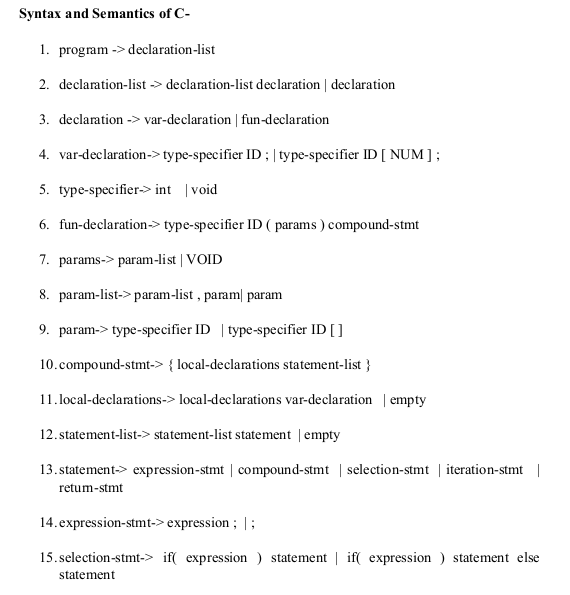
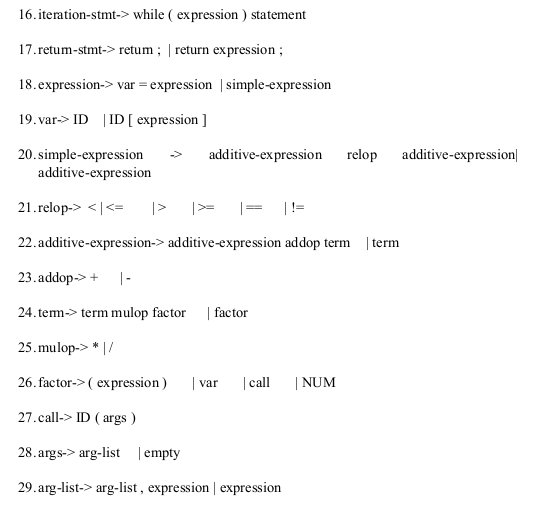

# lex-yacc

### Description

A simple Lexical Analyzer and a Syntax Analyzer for the language `C-` defined as below.


(Figure 1)


(Figure 2)

* `lexer.l` is the Lexical Analyzer.
* `parser.y` is the Parser (Syntax Analyzer)
* `lex.yy.c` is the compiled file from `lexer.l`

### To Run:

* Linux - Use `./compiler < testfile.c`

* Or to do everything manually:
``` bash
bison -d parser.y
lex lexer.l
g++ lex.yy.c parser.tab.c -o new
./new
```
and then put every row in the input.

# AST

### Description

A program that dumps ast for grammar.

### To run
``` bash
cd building_ast
bison Bison_Rule.y
bison -d Bison_Rule.y -o myapp.cpp
flex -o myapp_lex.cpp test.lex
g++ -o my myapp.cpp myapp_lex.cpp
./my 3.in 0
```

### In a need of compilation, run the makefile using `make -f MAKEFILE` (Linux).
