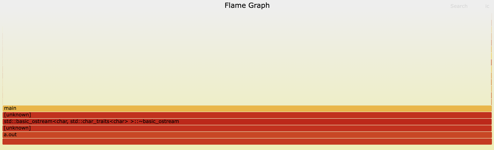

## “/usr/bin/time -- verbose ./a.out”
Команда «/usr/bin/time -- verbose ./a.out» використовується для вимірювання часу виконання програми. Вона надає детальну інформацію про ресурси, що використовуються програмою, такі як час CPU, використання пам'яті та статистика вводу-виводу.


Результати команди `/usr/bin/time -- verbose ./a.out` показують наступну інформацію:

`Command being timed`: команда, яка була запущена.

`User time (seconds)`: час, витрачений на виконання коду користувача.

`System time (seconds)`: час, витрачений на виконання системного коду.

`Percent of CPU this job got`: відсоток CPU, виділений для виконання даної програми.

`Elapsed (wall clock) time (h:mm:ss or m:ss)`: час, затрачений на виконання програми.

`Average shared text size (kbytes)`: середній розмір спільного тексту.

`Average unshared data size (kbytes)`: середній розмір неподілених даних.

`Average stack size (kbytes)`: середній розмір стеку.

`Average total size (kbytes)`: середній загальний розмір.

`Maximum resident set size (kbytes)`: максимальний розмір набору резидентної пам'яті.

`Average resident set size (kbytes)`: середній розмір набору резидентної пам'яті.

`Major (requiring I/O) page faults`: кількість мажорних помилок сторінки, які вимагають введення-виведення.

`Minor (reclaiming a frame) page faults`: кількість мінорних помилок сторінки, які відновлюють кадр.

`Voluntary context switches`: кількість добровільних перемикань контексту.

`Involuntary context switches`: кількість невільних перемикань контексту.

`Swaps`: кількість свопів.

`File system inputs`: кількість введень в файлову систему.

`File system outputs`: кількість виведень в файлову систему.

`Socket messages sent`: кількість відправлених повідомлень через сокет.

`Socket messages received`: кількість отриманих повідомлень через сокет.

`Signals delivered`: кількість доставлених сигналів.

`Page size (bytes)`: розмір сторінки.

`Exit status`: статус завершення.

## "perf stat -d ./a.out"


Команда `perf stat -d ./a.out` використовується для збору статистики профілювання процесу. Результати виводяться в форматі таблиці, де кожен рядок відповідає певному типу події профілювання, такому як кількість циклів, інструкцій, гілок, кеш-промахів тощо. Якщо певний тип події не підтримується апаратурою, то відображається повідомлення `<not supported>`.

У нашому випадку, результати показують наступне:

`task-clock:u`: час, затрачений на виконання програми.

`context-switches:u`: кількість перемикань контексту.

`cpu-migrations:u`: кількість міграцій процесора.

`page-faults:u`: кількість помилок сторінки.

`cycles:u`: кількість циклів процесора.

`instructions:u`: кількість інструкцій процесора.

`branches:u`: кількість гілок процесора.

`branch-misses:u`: кількість промахів гілок процесора.

`L1-dcache-loads:u`: кількість завантажень кеша першого рівня.

`L1-dcache-load-misses:u`: кількість промахів кеша першого рівня.

`LLC-loads:u`: кількість завантажень кеша останнього рівня.

`LLC-load-misses:u`: кількість промахів кеша останнього рівня.

Крім того, результати показують час, затрачений на виконання програми, час, затрачений на виконання користувацького коду та системного коду.


## “perf record ./a.out”/n“perf report”


Результати команди `perf report` показують наступну інформацію:

`Samples`: кількість вибірок.

`Event count (approx.)`: приблизна кількість подій профілювання, пов'язаних з даною функцією.

`Overhead`: відсоток часу, витраченого на виконання даної функції.

`Command`: ім'я команди, яка була профільована.

`Shared Object`: ім'я спільного об'єкта, який був профільований.

`Symbol`: ім'я символу, який був профільований.

У нашому випадку, результати `perf report` показують, що більша частина часу була витрачена на виконання функції `intel_check_word.constprop.0`, яка знаходиться в файлі 
`ld-linux-x86-64.so.2`.

## “продемонструвати процес побудови при захисті роботи”

Треба виконати наступні команди:

``` bash
cd FlameGraph 
perf record -g -o perf.data ../a.out
sudo perf script | ../FlameGraph/stackcollapse-perf.pl | ../FlameGraph/flamegraph.pl > perf.svg
```

## “пояснити (інтерпретувати) отримані на графіку результати”


Flame Graph - це тип візуалізації, який показує відносну кількість часу, витраченого на різні частини програми. Він корисний для розуміння продуктивності програми та ідентифікації областей для оптимізації. Flame Graph складається з горизонтальної стовпчастої діаграми з градієнтом червоно-помаранчевого кольору. Ось кілька ключових характеристик Flame Graph:

- Ось x представляє відносну кількість часу, витраченого на різні частини програми.
- Ось y представляє глибину стеку виклику.
- Ширина кожного стовпчика відображає відносну кількість часу, витраченого на виконання певної функції.
- Лейбли на стовпчиках відображають імена функцій.

“заміряти енерговитрати  системи при виконанні програми”

Щоб виконати цей етап, треба зробити наступне.

- Налаштувати систему таким чином, щоб відповідна програма запускалась кожну секунду.

    Для цього автор написав script.sh:

    ```bash
    while true; do
        ./a.out
        sleep 0.001
    done
    ```

    Далі запускаємо цей скріпт і програма ./a.out буде виконуватись кожну соту долю секунди:
    ```bash
    chmod +x script.sh
    ./script.sh
    ```
- Налаштувати вимірювання енерговитрат.
    Для цього запустимо команду `sudo powerstat 50 10`, яка буде вимірювати енерговитрати протягом 50ти секунд 10 разів:


Дані містять наступні колонки:
- Time: Час виконання команди.
- User: Відсоток часу, витраченого процесором на виконання користувацьких процесів.
- Nice: Відсоток часу, витраченого процесором на виконання процесів з низьким пріоритетом.
- Sys: Відсоток часу, витраченого процесором на виконання системних процесів.
- Idle: Відсоток часу, протягом якого процесор не виконував жодних процесів.
- IO: Відсоток часу, витраченого процесором на введення-виведення.
- Run: Кількість процесів, які були запущені за час виконання команди.
- Ctxt/s: Кількість змін контексту на секунду.
- IRQ/s: Кількість переривань на секунду.
- Fork: Кількість нових процесів, які були створені за час виконання команди.
- Exec: Кількість нових процесів, які були запущені за час виконання команди.
- Exit: Кількість процесів, які завершили свою роботу за час виконання команди.
- Watts: Середня потужність ватів, витрачена системою Ubuntu за час виконання команди.

## “заміряти енерговитрати виключно досліджуваної програми”

Для цього знайдемо спочатку енерговитрати системи не запускаючи скірпт:


Бачимо, що програма споживає недостатньо ресурсів, щоб помітити різницю у ватах.

## “порівняти час та інші показники (див. п.п. 2.1, 2.2, тощо) виконання до і після оптимізації”

Програма з нульовою оптимізацією:


Програма з третім рівнем оптимізації:


## “продемонструвати зміни на FlameGraph (п. 1) після оптимізації”

До оптимізації:


Після оптимізації:




## “порівняти енерговитрати (п. 3) після оптимізації ”

Програма без оптимізації:


Програма з оптимізацією -О3:


Можемо бачити, як змінились показники після оптимізації.